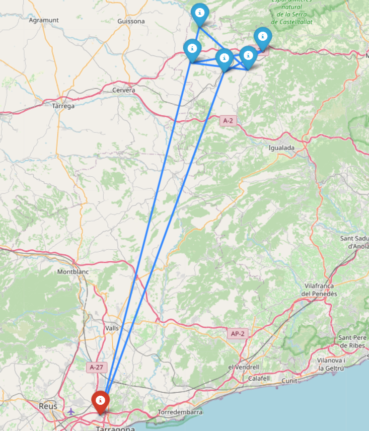
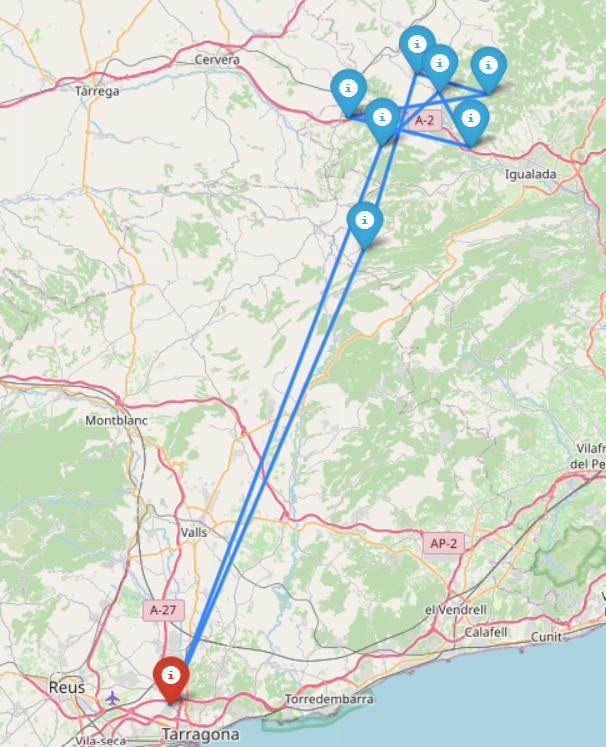
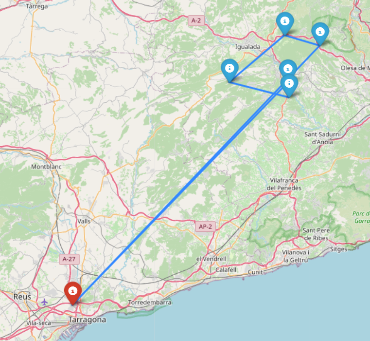
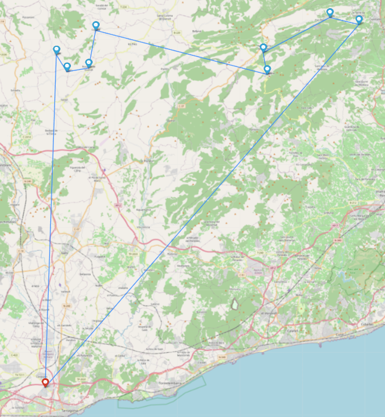

# UAB-Hackaton-2024

## Repte Caixa Enginyers

### Obtenció de les dades

#### Dades_Municipis.xlsx
Per extreure les dades del archiu 'Dades_Municipis.xlsx' executem el programa 'src/data/data.py' que converteix les dades a un format pandas.

#### Dades de Google Maps
Per poder obtenir referències entre les distàncies i el temps que es triga en anar d'un municipi a un altre, utilitzem l'API de Google Maps que ens proporciona el servei de Google Cloud.
Fem peticions a aquest servei mitjançant el programa 'src/main.py' i obtenim matrius d'adjacència entre els municipis de cada bloc que pertanyen al seu respectiu Lot en un format numpy.
Per exemple, l'arxiu '2_1.npy' és la matriu d'adjacència del Lot 2 i el bloc 1. L'arxiu '5_3.npy' és la matriu d'adjacència del Lot 5 i el bloc 3.
Com que la localització dels punts inicials de sortida de les furgonetes no es troba a l'excel, creem un altre arxiu que indica la distància del punt inicial a la resta de municipis. Per exemple, l'arxiu 'barcelona_4_2.npy' és un array de distàncies del punt inicial de Barcelona fins als municipis del bloc 2 del Lot 4.

## Resolució del problema
Per abordar aquest repte, hem utilitzat l'algoritme de Branch&Bound per obtenir un camí òptim. Aquest algoritme calcula un primer camí per aconseguir límits superiors i inferiors, permetent-nos així podar altres camins que no siguin més òptims que el camí òptim trobat fins al moment.

El codi general que executem per obtenir un camí òptim es troba a l'arxiu 'src/run_bandb.py', el qual importa les funcions dels arxius 'src/algorithms/bandb.py' i 'src/algorithms/workday_splitting.py'. Gràcies a això, podem obtenir un camí òptim i dividir-lo en camins més petits per tal que es puguin implementar en els dies i les hores laborables.

## Resultats
Gràcies a l'arxiu anteriorment esmentat, 'src/run_bandb.py', també podem visualitzar el camí resultant en un fitxer '.html':

    

        <h3>Camí del Lot-2 i bloc-1</h3>
        
    

    

        <h3>Camí del Lot-2 i bloc-2</h3>
        
    

    

        <h3>Camí del Lot-2 i bloc-3</h3>
        
    

    

        <h3>Camí del Lot-2 i bloc-4</h3>
        
    

Per visualitzar aquests resultats, has d'executar la següent línia de comandament en la terminal:  
`& C:/Users/chocl/AppData/Local/Microsoft/WindowsApps/python3.11.exe -m src.run_bandb`  
Això començarà a mostrar les imatges en format '.html' al teu navegador.